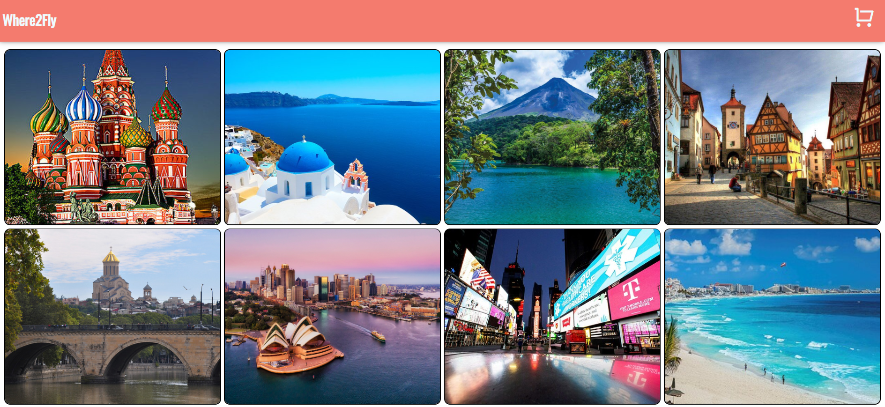

# Where2Fly
## Description

>  Following COVID-19, returning to the flight routine can be confusing.
>  Where is it allowed ? Where is it forbidden ?
>  In which countries is the morbidity situation high? Which one is not?
>  **"Where2Fly"** provides you the most up-to-date information, as of today.

## How Does It Work?

Choose the country you want to receive information about by clicking the plane icon.
Countries which do not allow entry, will have the description "No entry at this time", and a lock icon next to it.

Otherwise, click on the details reference for more information about COVID-19 state in the country.
If you are interested in booking the flight, go ahead and add it to your cart, using the plus icon.

## How Does It Looks Like?




## Technology Wise

This mini-project was created on client-site, using `React`. 
The components are purely functional components.

> - React hooks.
> - React customize hooks.
> - `react-router` - routing 
> - `React Context` -  maintaining state between components
> - ES6 logic

## Running On Your Local Machine

Feel free to get a copy of the project and run it on your local machine.
Here are some instructions:

### Prerequisites
Packages :
* `npm`
* `react`
* `react-dom`
* `react-router-dom`
* `reactjs-popup`

### Installing
```
npm install npm@latest -g

npm install --save react

npm install --save react-dom

npm install --save react-router

npm install --save reactjs-popup
```
